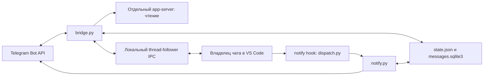

# Руководство разработчика

Актуальное описание реализации на 05.10.2026. Пользовательские сценарии: [USER_GUIDE.md](USER_GUIDE.md). Быстрый контекст агента: [AGENTS.md](AGENTS.md). Документация описывает текущий код; непроверенные на реальном Telegram сценарии перечислены отдельно.

## Назначение и среда

Проект: `/Users/aleksejkalinicenko/Workspace/10_codex_remote_pult`. Личный Telegram-пульт для Codex в VS Code на macOS, бот `@codex_remote_pult_bot`. Ранее код находился в «шаблоны первичка», перенесён по просьбе пользователя. Новые файлы бота размещать здесь.

Python 3.13 используется в установленном LaunchAgent. Основная реализация — стандартная библиотека; certifi используется для TLS, если установлен. Нужен Codex CLI в PATH, авторизованный тем же аккаунтом и CODEX_HOME, что и расширение. Проверявшееся расширение: `openai.chatgpt-26.930.41038-darwin-arm64`, CLI: 0.153.0. Внутренний IPC зависит от версии; совпадение названия метода не гарантирует совместимость payload.

## Архитектура



Мост получает Telegram updates долгим опросом, без webhook и внешнего порта. Отдельный app-server нужен для списков, лимитов и истории; он не делает resume существующего чата для записи. Запуск и остановка передаются владельцу через IPC. Разрешения читаются из живых снимков, решения тоже отправляются владельцу. Финал читается по threadId/turnId из истории и пересылается через notify.send.

Новый чат — исключение: короткоживущий app-server создаёт новую беседу, сохраняет запись о происхождении, отписывается и завершается до открытия беседы в VS Code. Он не запускает модель.

## Карта модулей

| Файл | Ответственность |
|---|---|
| bridge.py | App-server RPC, polling Telegram, команды, запуск запроса, ожидание финала, жизненный цикл |
| layout.py | Оформление Б, Markdown-подмножество и UTF-16 entities |
| questions.py | Формы request_user_input, кнопки, свой ответ и отправка исходному owner |
| features.py | Очередь, подписки и снимки, разрешения владельца, выбор и отправка файлов |
| vscode_ipc.py | Unix socket, framing, discovery, версии, input UI, решения и подписки |
| notify.py | Telegram JSON API, TLS, UTF-16 chunks, формат финала, setup/test, дедупликация |
| chat_store.py | Общая SQLite: message_id → thread, названия, cwd, последний ответ |
| media.py | Входящие вложения: getFile, ограниченная загрузка, пути и права |
| outgoing.py | Поиск локальных Markdown-ссылок, проверка границ, multipart sendDocument |
| new_chat.py | Создание и сохранение новой беседы; открытие URI VS Code |
| ui.py | Постоянная клавиатура, алиасы кнопок, формат лимитов |
| mode.py | Сохранённый переключатель /on и /off |
| delivery.py | O_EXCL отметки доставки по thread/turn/status |
| dispatch.py | Сохранение предыдущего notify и дополнительный вызов Telegram |
| runtime.py | flock: один экземпляр моста |
| autostart.py | Установка и управление macOS LaunchAgent |
| tests/test_features.py | Регрессионные проверки без сети и запуска модели |

## Контракты, которые нельзя потерять

1. Запросы принимаются только из настроенного личного чата; callbacks проверяют отправителя и чат сообщения.
2. Обычный текст идёт в выбранный чат. Reply сначала проверяется по message_id в SQLite, затем по строке `Чат: ID`. Это важнее текущего выбора.
3. Все части финального ответа содержат название и ID. Текст делится по UTF-16, body до 3000 единиц, общий текст меньше Telegram 4096. Разметка Telegram не включается.
4. UI input текста обязательно содержит `text_elements: []`. Для изображения используется `localImage`, не слепо скопированный формат публичного API.
5. Не запускать второй writer существующей беседы: thread/resume отдельного процесса конфликтует с владельцем VS Code.
6. Очередь фиксирует thread в момент получения; смена выбранного чата не меняет задачи.
7. Запуск требует свежего живого снимка, отсутствия активного turn/интерактивного запроса и того же владельца.
8. До отправки start сохраняется dispatching. После получения turnId сохраняется active с queueId. Перезапуск не повторяет неопределённый запуск.
9. /off не останавливает активную работу; /stop останавливает запрос моста и ставит очередь на паузу.
10. Не выдавать постоянные разрешения. Решение относится к исходным thread/request/owner; permissions копируются из запроса со scope=turn.
11. Не отключать TLS, не логировать token, URL Bot API с token, credentials или содержимое приватных снимков целиком.

## Состояние и восстановление

`credentials.json`: token и chat_id, права 0600. Настройка `notify.py --setup`.

`mode.json`: enabled; отсутствие/ошибка чтения означает выключенный режим.

`state.json`: Telegram offset, thread/cwd, active, queue/queue_paused и карты кнопок. Записывается через временный файл и rename. Offset сохраняется до исполнения update, чтобы не переигрывать промпт. Цена такого подхода: сбой после записи offset может потерять обработку сообщения.

Очередь до 20 задач, общая FIFO. pending ждёт; dispatching — отправка началась; failed и uncertain требуют ручной проверки/удаления. Первая заблокированная задача удерживает следующие. На старте dispatching становится uncertain, кроме записи, совпадающей с известным active.queueId: она уже запущена и удаляется из очереди.

`messages.sqlite3`: таблицы messages(chat,message,thread), threads(id,title,cwd,answer). Общая для hook и моста; SQLite timeout=10. Название сначала ищется read-only в локальной Codex state_*.sqlite: name/title/preview; затем берётся из собственного cache, далее ID. Внутренняя схема Codex может измениться.

`deliveries/`: SHA256 от thread:turn, для неуспешных исходов ещё status. Это защита от двойного финала из hook и моста, не очередь гарантированной доставки. Crash после claim до отправки может оставить пропуск. Частичная отправка и повтор после сетевого сбоя могут продублировать ранее отправленные части.

`incoming/`: уникальные каталоги 0700, файлы 0600, до 20 МБ, без автоматического удаления. `bridge.lock`: flock. `logs/` и server.log: диагностика. Все runtime-файлы исключены из git. Не удалять state/receipts ради «чистого теста» без разбора последствий.

## IPC владельца

Сокет: `$CODEX_HOME/ipc/ipc.sock`, по умолчанию `~/.codex/ipc/ipc.sock`. Проверяются владелец сокета/каталога и отсутствие group/world write. Frame: длина JSON uint32 little-endian, затем JSON. Один поток чтения распределяет responses по requestId, broadcasts в очередь событий. Bridge не становится владельцем и отвечает canHandle=false на discovery.

Версии: initialize=0, owner-discovery=1, start-turn=2, interrupt-turn=4, load-complete-history=1, решения command/file/permissions=1. Broadcast stream-state=11, following-changed=1.

Подписка following=true вызывает snapshot владельца. Мост запрашивает снимки раз в 5 секунд: выбранный, активный, первый чат очереди и 10 недавних бесед без parentThreadId. Patches сейчас игнорируются; состояние обновляется следующим полным snapshot. Не заменять такой подход применением patches без обработки revision/baseRevision и восстановления пропусков.

Снимок имеет conversationId, hostId=local, change.type=snapshot, conversationState и sourceClientId. Активность может находиться в turns или canonical turnHistory.history.entitiesByKey. Ожидающие формы находятся в requests; completed запросы исключаются. Важно: requests.id передаётся владельцу в исходном типе, без строкового преобразования. Кнопки используют отдельный короткий UUID.

`thread-follower-command-approval-decision` и file-approval получают conversationId/requestId/decision (accept/decline). permissions-response получает response.permissions из запроса или {}, scope=turn. Старая кнопка не действует после исчезновения request; снимок старше 10 секунд требует обновления и повторного нажатия.

Публичная история временно описывает незавершённый хвост как interrupted. Нельзя считать это завершением. Код ждёт completed, заполненный error для failed либо подтверждённую остановку/живой interrupted. Не возвращать старую логику «любой interrupted → финал отсутствует».

## Новая беседа и вложения

New chat использует experimentalApi=true, historyMode=legacy. Пустой thread/start не гарантирует сохранение после завершения процесса. thread/inject_items добавляет пользовательскую запись «Чат создан из Telegram. Задача будет отправлена следующим сообщением.». Далее thread/unsubscribe, проверка rollout-файла и завершение процесса. Историю вручную не редактировать.

Открытие: `/usr/bin/open -g vscode://openai.chatgpt/local/<UUID>`. Успех open — лишь передача команды системе, не подтверждение готовности владельца. Первый раз требуется разрешить URI в VS Code; пользователь может убрать повторный вопрос.

Входящие media скачиваются лишь при готовности задачи к запуску. Telegram file_path проверяется; чтение ограничено фактическим размером, частичная загрузка удаляется. Имя не позволяет выйти через ../. Изображения — localImage; документы — JSON-экранированный путь в тексте промпта. Голосовые не распознаются по выбору пользователя: используется диктовка клавиатуры.

Выходящие файлы берутся только из Markdown-ссылок последнего ответа, до 20 кандидатов. Допустим существующий файл в cwd беседы после resolve; .git/.secrets/.aws/.codex, credentials.json и .env исключены. Поддержаны ссылки с угловыми скобками, пробелами, URL encoding и суффиксом номера строки. Лимит загрузки sendDocument — 50 МБ. Реальная отправка происходит по кнопке и сохраняет привязку ответа к беседе.

## Разработка и проверка

```sh
cd /Users/aleksejkalinicenko/Workspace/10_codex_remote_pult
PYTHONDONTWRITEBYTECODE=1 python3 -m unittest discover -s tests -v
python3 autostart.py restart
python3 autostart.py status
```

Тесты изолируют SQLite, сеть и IPC. Для изменения протокола сначала читайте установленный extension.js/webview assets и генерируйте схему соответствующего CLI в /private/tmp. Не патчите расширение и не переустанавливайте его ради исправления бота.

После проверки перезапускайте только мост; это не Reload Window и не остановка модели в VS Code. Две копии блокирует flock. Не запускайте bridge.py вручную поверх LaunchAgent. Перезагрузка VS Code может понадобиться при изменении глобального notify, но не при обычном обновлении Python.

LaunchAgent: `~/Library/LaunchAgents/local.codex-remote-pult.plist`, label `local.codex-remote-pult`, GUI domain текущего пользователя. PATH включает Python, npm-global и стандартные Mac каталоги. install прекращает прежние копии только этого проекта. После переноса папки или смены Python переустановите LaunchAgent и проверьте путь notify в Codex config.

## Диагностика и статус проверок

Вручную подтверждены пользователем: текстовый roundtrip, получение изображения, чтение документа, переключатель режима, reply-маршрутизация, диктовка, скачивание готового файла новой кнопкой. 39 автотестов проходят. Регрессионные тесты покрывают части ответа, queue recovery, busy/off/pause, точные permissions, stale кнопки, файлы/multipart, вложения в очереди и доступ постороннего пользователя.

В отдельной беседе подтверждено появление настоящего command approval с reviewer=user и waitingOnApproval, а также requestUserInput с одним вопросом и тремя вариантами. Доставка вопроса зарегистрирована в SQLite. Полные циклы разрешения/отказа и возврата выбранного/собственного ответа подтверждены пользователем. Живая очередь с перезапуском также остаётся незавершённой. Создание/сохранение новой беседы проверено; автоматический переход к готовому владельцу требует подтверждения URI в VS Code и отдельной проверки первого промпта. Не выдавать успешный возврат open за end-to-end проверку.

Симптомы:

- active writer / thread-store conflict: появилась запись вторым процессом; проверить, не добавлен ли resume.
- ChatGPT hit a snag после Telegram: в первую очередь проверить формат input и text_elements.
- interrupted без финала: сравнить живой снимок, не очищать active по незавершённой истории.
- request-version-mismatch: сравнить установленный протокол и VERSIONS.
- очередь ждёт владельца: чат закрыт, нет разрешения URI или snapshot устарел.
- Telegram 409: второй polling процесс или webhook.
- TLS/DNS: проверить certifi, интернет/VPN; сертификаты не отключать.

## Ограничения и дальнейшая работа

Нет гарантированной очереди доставки ответов, распознавания voice/audio, albums/video/stickers, дистанционной обработки OAuth и работы без Mac/VS Code. Нет произвольного ввода папки нового чата и очередей по отдельным беседам. Разрешения охватывают наблюдаемые недавние чаты, а не абсолютно все беседы аккаунта. Нет гарантии от гонки, если пользователь начинает новый desktop turn сразу после проверенного snapshot.

Ближайшие полезные изменения: надёжная доставка с retry по частям, сохранение частичных ответов на вопросы, более явный статус ожидания владельца, контроль совместимости IPC, выбор произвольного проекта по разрешённому списку. Любую новую возможность документировать вместе с изменением кода.

Официальные ссылки: [Codex app-server](https://learn.chatgpt.com/docs/app-server), [notify](https://learn.chatgpt.com/docs/config-file/config-advanced#notifications), [Telegram Bot API](https://core.telegram.org/bots/api). Для внутреннего IPC источник — установленная версия расширения, а не публичная схема app-server.

## GitHub и локальные настройки

Код, документация, тесты и иконка хранятся в приватном GitHub-репозитории.
credentials.json, state/mode, SQLite, deliveries, incoming и логи не коммитятся.
previous-notify.json тоже локальный: содержит команду прежнего notify для конкретного Mac.
При его отсутствии dispatch.py запускает только Telegram notify. При необходимости
сохранить существующий обработчик запишите его команду массивом строк в этот файл
перед подключением dispatch.py в глобальной конфигурации Codex. Не перезаписывайте
прежний notify без сохранения его команды. На новой машине отдельно выполните
notify.py --setup и autostart.py install и настройте Codex notify.

## Выбор вида нового чата (05.10.2026)

/new сначала предлагает «Общий чат» или «Чат в проекте». Одноразовые ключи
new_chat_kinds в state защищают от повторного клика. Для project используется
список разных cwd недавних чатов; GENERAL_CHAT и его потомки исключены.
Для general папка выбирается автоматически: ~/Library/Application Support/CodexRemotePult/general-chat.
Она находится за пределами проекта бота, чтобы не наследовать его AGENTS.md.
Каталог создаётся при выборе general, а не при открытии меню. Оба варианта
используют прежний create_chat и передачу владельцу VS Code. /off и занятый
запрос блокируют создание, «Отмена» удаляет оба вида ключей. Общая папка —
технический cwd, а не отдельный облачный режим и не дополнительная изоляция.

## Кнопка режима (05.10.2026)

ui.keyboard(enabled()) формирует актуальную панель при каждом обычном ответе
моста. Первая строка содержит одну кнопку: «🔴 Выключен · включить» → /on
или «🟢 Включён · выключить» → /off. Действие определяется подписью, а не
инверсией текущего значения: повторный клик старой кнопки идемпотентен.
Старые текстовые кнопки и команды /on, /off сохранены для совместимости.
После переключения ответ моста обновляет клавиатуру; /start тоже обновляет её.


## Прямое скачивание (05.10.2026)

После финального ответа notify.send отправляет предложение файлов с кнопками file:ID
и командами /file_ID. outgoing.file_offer регистрирует допустимые ссылки в общей
SQLite downloads (id/thread/cwd/path), поэтому ключ не зависит от выбора чата,
последнего ответа или перезапуска. /files использует тот же реестр; старые
state.file_choices читаются для совместимости. Bridge принимает только 16 hex
символов и проверяет личный чат перед командой. При отправке повторно проверяются
режим, границы cwd, существование и размер файла. Новый реестр не содержит токенов;
messages.sqlite3 по-прежнему исключён из git.


## Вопросы агента (05.10.2026)

questions.Questions подключён к Features. stream snapshots наблюдают
item/tool/requestUserInput. Каждый вопрос получает UUID и кнопки question:key:index
или question:key:custom. Свой текст принимается через reply к вопросу/force_reply
или /answer KEY текст. question_replies в общей SQLite связывает message_id с ключом;
проверка отправителя выполняется до обработки текста и callback. Обычный текст
без такой привязки остаётся промптом. Вопросы isSecret не пересылаются.

Ответ: thread-follower-submit-user-input v1 с conversationId, исходным requestId,
response.answers[question.id].answers=[text], target=исходный owner. Варианты берутся
из label, не из callback-текста. Перед передачей проверяются /on, snapshot <=10s,
owner и наличие неизменного pending request. При нескольких вопросах сохраняются
частичные ответы в памяти, форма передаётся целиком. Повтор выбранного ответа
не действует. После перезапуска живые вопросы объявляются с новыми ключами,
частичные ответы сбрасываются. Форма, уже решённая в VS Code, удаляется.

Автотесты: четыре варианта + custom, текстовый reply и команда, несколько вопросов,
маршрутизация, off/stale/unauthorized/desktop-resolved, повтор и restart, secrets.
Настоящий вопрос с тремя вариантами появился в VS Code; Telegram-доставка зарегистрирована. Возврат выбранного и собственного ответа подтверждён пользователем.


## Завершить живую проверку

Проводить только в отдельной тестовой беседе, с включённым /on. Не использовать
чат с текущей работой. Не менять глобальные разрешения ради теста.

1. Разрешение: для безопасного создания тестового marker-файла задать только
   тестовой беседе approvalPolicy=on-request и approvalsReviewer=user, без
   постоянных правил. Убедиться в настоящем pending request, нажать кнопку
   Telegram. Ожидание: подтверждение доставки решения и создание marker.
2. Отказ: второй запрос с другим marker. Нажать «Отклонить». Ожидание:
   отказ передан исходному owner, второй marker не создан, обхода отказа нет.
3. Вопрос: вызвать настоящий request_user_input в поддерживающем его режиме.
   Нажать один готовый вариант, проверить дословное получение агентом.
   Во второй форме нажать «Свой ответ», ответить текстом (например,
   «Фиолетовый»), проверить тот же текст у агента. Не подменять формой
   обычное сообщение с перечислением вариантов. После restart брать новые кнопки.
4. Очередь: первую тестовую задачу сделать достаточно долгой, затем отправить
   две короткие с разными метками в ту же беседу. Дождаться active первой
   и двух pending в /queue; перезапустить только мост через autostart.py restart.
   Проверить восстановление active, порядок трёх результатов и отсутствие
   повторного запуска; итог active=null, очередь пуста. После uncertain не
   переигрывать задачу автоматически — сначала проверить историю.

Не считать пункты пройденными по отсутствию ошибки, возврату команды open,
mock-тесту или ответу агента, который лишь пересказывает присланный текст.

Справка /help и /start используют ui.HELP_TEXT; /guide читает USER_GUIDE.md
с диска. При добавлении команд обновлять оба текста. Текущие /help и /guide
не запускают модель и доступны при /off.


## Оформление Б (05.10.2026)

Все обычные sendMessage проходят через layout.message_data в notify.api.
Пользователь выбрал открытый blockquote для основного текста: chat name bold,
разделители, технический подвал italic. Никаких спойлеров. Для сообщений без
беседы используется заголовок приложения. notify.send передаёт _presentation
с отдельными body/event/title/meta; приватное поле удаляется перед Bot API.
Данные агента не сканируются как технические поля, поэтому его строки «Чат:»
и «Проект:» сохраняются в ответе. service_parts используется для собственных
сервисных сообщений, поля Беседа/Чат/Проект/Папка/Статус/Часть идут в подвал.

entities вместо parse_mode защищают текст от HTML-инъекций. Смещения и длины
считаются в UTF-16. Поддержано подмножество Markdown: headings, bold,
inline code, fenced pre, HTTP(S) links. Остальной текст сохраняется. pre
не пересекается с blockquote, чтобы оба блока читались и форматировались отдельно.
Bridge делит основное тело по 3000 UTF-16 units и повторяет контекст на каждой
части; notify использует прежнюю длину тела. Bind каждого message_id сохраняется.
Подписи файлов содержат caption_entities и исходный thread ID. Уже отправленные
сообщения не редактируются.

Проверки в tests/test_layout.py: границы body/footer, строки metadata внутри ответа,
Unicode offsets, код и HTML как текст, реальные JSON payload/кнопки, длинные части
с сохранением ответа и reply route, force_reply и контекст вопроса.


## Зеркало переписки (07.10.2026)

mirror.ConversationMirror подключён к полным IPC snapshots в Features.stream_event.
Использует turns и canonical turnHistory.history.entitiesByKey, сортировку по
turnStartedAtMs и дедупликацию по item ID. Передаёт только userMessage,
steeringUserMessage и agentMessage с phase=commentary. Для потокового agentMessage
ждёт agentMessageCompletedAtMsById либо терминальный статус turn. Финалы остаются
на notify.send с существующими общими receipts hook/bridge. Patches не применяются.

Первый снимок каждой беседы служит границей: сообщения turn, начатых до запуска
моста или переключения режима, отмечаются просмотренными. Новые turn уже после
границы пересылаются и на первом снимке. Старое сообщение незавершённого turn
не выгружается; последующие новые items этого turn пересылаются. /on и /off
сбрасывают границу наблюдения, сохраняя IDs. Никаких изменений истории Codex.

В messages.sqlite3 добавлены mirror_items (просмотренные IDs), mirror_phone
(clientUserMessageId Telegram-промптов, записывается до IPC request), mirror_parts
(подтверждённые части доставки). Тексты зеркала не сохраняются. Формат Б, UTF-16
chunks по 3000, title, event, thread metadata и bind сохраняются. Между отправками
зеркала выдерживается минимум 1.1 секунды. Ошибка пересылки не прерывает обработку
разрешений; повтор на следующем снимке не повторяет подтверждённые части.

Это не гарантированная доставка: потерянное сетевое подтверждение может дать
повтор; restart не восстанавливает неподтверждённый backlog. Отсутствующий owner
или беседа вне десяти недавних/выбранной/активной/очереди не наблюдается. Вложения
из VS Code не скачиваются, изображения обозначаются маркером.

52 автотестов: новые 10 проверяют обе стороны, исключение финалов/рассуждений,
baseline/restart/off/on, происхождение Telegram, canonical history, завершение
стриминга, повтор частичной доставки и reply маршрутизацию.

Живая проверка 07.10.2026: отдельная свободная беседа VS Code, настоящий turn
через владельца. Подтверждены Telegram API-доставка userMessage и commentary
(по одной части в mirror_parts), финал через существующий hook и его receipt.
Ранняя phase=None у streamed placeholder учтена отдельным тестом. Фоновый мост
перезапущен, state=running, stderr пуст. Режим пользователя не изменялся.


Обновление оформления 07.10.2026: нижний блок «Технические данные» и его
разделитель убраны из новых сообщений. ID чата, путь проекта и служебные
статусы в подвале не показываются. Название беседы, текст и прежнее оформление
основного блока сохранены. Ответ через reply работает по внутренней привязке
message_id в SQLite; видимый ID для этого не нужен. Старые сообщения не меняются.


Утверждённое оформление 07.10.2026 — вариант 1: «👤 Ты · Название чата»
и обычный текст пользователя; «🤖 Агент · Название чата» и blockquote агента.
Без декоративных линий, технического подвала и отдельной строки об успешном
завершении. Предупреждения о сбое/остановке и интерактивные кнопки сохраняются.
Это заменяет прежнее оформление Б; старые сообщения не редактируются.


Актуальное поведение (07.10.2026, после проверки пользователем): зеркало
пересылает только сообщения пользователя. От агента приходит только конечный
ответ через notify.send и общие receipts; commentary не пересылать.
Автоматическое отдельное предложение готовых файлов отключено; получить
файлы можно через /files или кнопку «Файлы». Ссылки внутри самого конечного
ответа сохраняются. Под заголовком каждого сообщения — жирная горизонтальная
черта; технического подвала нет. Сообщение о подключении моста сохраняется.
Эти правила заменяют предыдущие описания промежуточной пересылки и оформления.


Последнее решение пользователя 07.10.2026: копии запросов с компьютера тоже
отключены, включая IDE context и список вкладок. Модуль mirror удалён. Полные
IPC snapshots используются только для очереди, разрешений и вопросов; текст
переписки из snapshots не отправляется. Финал приходит через notify.send с
общими receipts. Сообщение «Мост Codex подключён» по запуску оставлено полезным;
оно означает старт процесса, а не каждое обновление соединения. Ручное применение
обновления через restart вызывает одно новое такое уведомление.


Итоговое уточнение пользователя 07.10.2026: пересылать запросы с десктопа,
но не повторять запросы из Telegram. DesktopMirror определяет Telegram-origin
по clientUserMessageId, сохранённому до IPC dispatch в mirror_phone SQLite;
совпадение текста не используется. В начале стандартного IDE envelope убираются
вкладки и контекст до «## My request:», сам запрос сохраняется.
Agent snapshots не пересылаются; конечные ответы только notify.send.
Новая история не выгружается при /on или restart. Оформление и горизонтальная
черта сохранены, дополнительные file offers отключены. Эти правила заменяют
предыдущую полную отмену зеркала.


Утверждённые заголовки 07.10.2026: «👤 ВЫ → АГЕНТ · Название чата»
для пересланного десктопного запроса и «🤖 АГЕНТ → ВАМ · Название чата»
для конечного ответа. Под заголовком жирная горизонтальная черта.
Пользовательский текст обычный, ответ агента в blockquote. Номера пар не добавлены.
Правила источников и отсутствие технического подвала сохранены.


Временные статусы (07.10.2026): «В очереди» и «Промпт запущен» удаляются
после подтверждённой доставки всего конечного ответа именно этого запроса.
Очередь связывается с thread/turn; IDs двух уведомлений и подтверждение финала
хранятся в SQLite progress_runs/progress_notices/progress_finals. Состояние
переживает restart; быстрый финал до записи статуса тоже обработан.
Ошибки, вопросы, разрешения, подключения и ручной /queue не удаляются.
Удаление через deleteMessages не меняет исходный запрос и ответ агента.
Сбой удаления не повторяет ответ; cleanup повторяется фоновым sweep раз в
30 секунд. Telegram ограничивает удаление возрастом сообщения (до 48 часов),
поэтому для очень долгой задачи статус может остаться. Старые сообщения,
не зарегистрированные этим механизмом, не удаляются автоматически.
56 тестов прошли; в живом Telegram подтверждено удаление двух специально
созданных тестовых статусов после ответа.


Маркеры, утверждены 07.10.2026: 🟢 ВЫ → АГЕНТ, 🔵 АГЕНТ → ВАМ.
Меняются только значки автора; остальные оформление и поведение сохранены.


Уточнение 07.10.2026: удаление временных статусов выполняется ДО следующего
этапа: «В очереди» перед «Промпт запущен», «Промпт запущен» перед отправкой
конечного ответа. Привязка строго по queue/thread/turn. Если Telegram не смог
удалить статус, ответ не блокируется, cleanup после доставки и sweep повторяют
удаление. При сбое отправки финал можно повторить; прежний статус уже удалён.


Панель управления (07.10.2026): notify.send прикрепляет reply keyboard
с is_persistent=True к каждой части конечного ответа. Состояние кнопки
/on-/off берётся из enabled() при отправке. Отдельного сообщения ради
панели нет; удаление временных статусов не удаляет конечный ответ с панелью.


Асинхронные вопросы (09.10.2026): questions.live_questions объединяет
item/tool/requestUserInput и agentMessage.questions из turns / canonical
turnHistory. questionItemId совпадает с установленным UI:
JSON.stringify(["request_user_input_async", sourceItemId, questionIndex]).
Принятый userMessage/steeringUserMessage с send_user_message_question_reply
закрывает вопрос; pending/rejected steering его не закрывает. Первый snapshot
не выгружает архивные turns. После успешной отправки собственный вопрос
не объявляется повторно до обновления snapshot.
Ответ на async-форму идёт через thread-follower-steer-turn v1 при inProgress
(с restoreMessage/context исходного проекта) или thread-follower-start-turn v2
после окончания, всегда исходному owner. clientUserMessageId сохраняется
в mirror_phone до dispatch. Блокирующие формы сохраняют прежний
thread-follower-submit-user-input. Установленные extension assets проверены;
63 теста прошли. Живой цикл асинхронного вопроса пользователем ещё не подтверждён.
