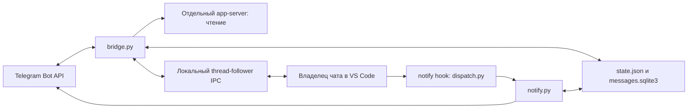

# Руководство разработчика

Актуальное описание реализации на 04.10.2026. Пользовательские сценарии: [USER_GUIDE.md](USER_GUIDE.md). Быстрый контекст агента: [AGENTS.md](AGENTS.md). Документация описывает текущий код; непроверенные на реальном Telegram сценарии перечислены отдельно.

## Назначение и среда

Проект: `/Users/aleksejkalinicenko/Workspace/10_codex_remote_pult`. Личный Telegram-пульт для Codex в VS Code на macOS, бот `@codex_remote_pult_bot`. Ранее код находился в «шаблоны первичка», перенесён по просьбе пользователя. Новые файлы бота размещать здесь.

Python 3.13 используется в установленном LaunchAgent. Основная реализация — стандартная библиотека; certifi используется для TLS, если установлен. Нужен Codex CLI в PATH, авторизованный тем же аккаунтом и CODEX_HOME, что и расширение. Проверявшееся расширение: `openai.chatgpt-26.930.41038-darwin-arm64`, CLI: 0.153.0. Внутренний IPC зависит от версии; совпадение названия метода не гарантирует совместимость payload.

## Архитектура



Мост получает Telegram updates долгим опросом, без webhook и внешнего порта. Отдельный app-server нужен для списков, лимитов и истории; он не делает resume существующего чата для записи. Запуск и остановка передаются владельцу через IPC. Разрешения читаются из живых снимков, решения тоже отправляются владельцу. Финал читается по threadId/turnId из истории и пересылается через notify.send.

Новый чат — исключение: короткоживущий app-server создаёт новую беседу, сохраняет запись о происхождении, отписывается и завершается до открытия беседы в VS Code. Он не запускает модель.

## Карта модулей

| Файл | Ответственность |
|---|---|
| bridge.py | App-server RPC, polling Telegram, команды, запуск запроса, ожидание финала, жизненный цикл |
| features.py | Очередь, подписки и снимки, разрешения владельца, выбор и отправка файлов |
| vscode_ipc.py | Unix socket, framing, discovery, версии, input UI, решения и подписки |
| notify.py | Telegram JSON API, TLS, UTF-16 chunks, формат финала, setup/test, дедупликация |
| chat_store.py | Общая SQLite: message_id → thread, названия, cwd, последний ответ |
| media.py | Входящие вложения: getFile, ограниченная загрузка, пути и права |
| outgoing.py | Поиск локальных Markdown-ссылок, проверка границ, multipart sendDocument |
| new_chat.py | Создание и сохранение новой беседы; открытие URI VS Code |
| ui.py | Постоянная клавиатура, алиасы кнопок, формат лимитов |
| mode.py | Сохранённый переключатель /on и /off |
| delivery.py | O_EXCL отметки доставки по thread/turn/status |
| dispatch.py | Сохранение предыдущего notify и дополнительный вызов Telegram |
| runtime.py | flock: один экземпляр моста |
| autostart.py | Установка и управление macOS LaunchAgent |
| tests/test_features.py | Регрессионные проверки без сети и запуска модели |

## Контракты, которые нельзя потерять

1. Запросы принимаются только из настроенного личного чата; callbacks проверяют отправителя и чат сообщения.
2. Обычный текст идёт в выбранный чат. Reply сначала проверяется по message_id в SQLite, затем по строке `Чат: ID`. Это важнее текущего выбора.
3. Все части финального ответа содержат название и ID. Текст делится по UTF-16, body до 3000 единиц, общий текст меньше Telegram 4096. Разметка Telegram не включается.
4. UI input текста обязательно содержит `text_elements: []`. Для изображения используется `localImage`, не слепо скопированный формат публичного API.
5. Не запускать второй writer существующей беседы: thread/resume отдельного процесса конфликтует с владельцем VS Code.
6. Очередь фиксирует thread в момент получения; смена выбранного чата не меняет задачи.
7. Запуск требует свежего живого снимка, отсутствия активного turn/интерактивного запроса и того же владельца.
8. До отправки start сохраняется dispatching. После получения turnId сохраняется active с queueId. Перезапуск не повторяет неопределённый запуск.
9. /off не останавливает активную работу; /stop останавливает запрос моста и ставит очередь на паузу.
10. Не выдавать постоянные разрешения. Решение относится к исходным thread/request/owner; permissions копируются из запроса со scope=turn.
11. Не отключать TLS, не логировать token, URL Bot API с token, credentials или содержимое приватных снимков целиком.

## Состояние и восстановление

`credentials.json`: token и chat_id, права 0600. Настройка `notify.py --setup`.

`mode.json`: enabled; отсутствие/ошибка чтения означает выключенный режим.

`state.json`: Telegram offset, thread/cwd, active, queue/queue_paused и карты кнопок. Записывается через временный файл и rename. Offset сохраняется до исполнения update, чтобы не переигрывать промпт. Цена такого подхода: сбой после записи offset может потерять обработку сообщения.

Очередь до 20 задач, общая FIFO. pending ждёт; dispatching — отправка началась; failed и uncertain требуют ручной проверки/удаления. Первая заблокированная задача удерживает следующие. На старте dispatching становится uncertain, кроме записи, совпадающей с известным active.queueId: она уже запущена и удаляется из очереди.

`messages.sqlite3`: таблицы messages(chat,message,thread), threads(id,title,cwd,answer). Общая для hook и моста; SQLite timeout=10. Название сначала ищется read-only в локальной Codex state_*.sqlite: name/title/preview; затем берётся из собственного cache, далее ID. Внутренняя схема Codex может измениться.

`deliveries/`: SHA256 от thread:turn, для неуспешных исходов ещё status. Это защита от двойного финала из hook и моста, не очередь гарантированной доставки. Crash после claim до отправки может оставить пропуск. Частичная отправка и повтор после сетевого сбоя могут продублировать ранее отправленные части.

`incoming/`: уникальные каталоги 0700, файлы 0600, до 20 МБ, без автоматического удаления. `bridge.lock`: flock. `logs/` и server.log: диагностика. Все runtime-файлы исключены из git. Не удалять state/receipts ради «чистого теста» без разбора последствий.

## IPC владельца

Сокет: `$CODEX_HOME/ipc/ipc.sock`, по умолчанию `~/.codex/ipc/ipc.sock`. Проверяются владелец сокета/каталога и отсутствие group/world write. Frame: длина JSON uint32 little-endian, затем JSON. Один поток чтения распределяет responses по requestId, broadcasts в очередь событий. Bridge не становится владельцем и отвечает canHandle=false на discovery.

Версии: initialize=0, owner-discovery=1, start-turn=2, interrupt-turn=4, load-complete-history=1, решения command/file/permissions=1. Broadcast stream-state=11, following-changed=1.

Подписка following=true вызывает snapshot владельца. Мост запрашивает снимки раз в 5 секунд: выбранный, активный, первый чат очереди и 10 недавних бесед без parentThreadId. Patches сейчас игнорируются; состояние обновляется следующим полным snapshot. Не заменять такой подход применением patches без обработки revision/baseRevision и восстановления пропусков.

Снимок имеет conversationId, hostId=local, change.type=snapshot, conversationState и sourceClientId. Активность может находиться в turns или canonical turnHistory.history.entitiesByKey. Ожидающие формы находятся в requests; completed запросы исключаются. Важно: requests.id передаётся владельцу в исходном типе, без строкового преобразования. Кнопки используют отдельный короткий UUID.

`thread-follower-command-approval-decision` и file-approval получают conversationId/requestId/decision (accept/decline). permissions-response получает response.permissions из запроса или {}, scope=turn. Старая кнопка не действует после исчезновения request; снимок старше 10 секунд требует обновления и повторного нажатия.

Публичная история временно описывает незавершённый хвост как interrupted. Нельзя считать это завершением. Код ждёт completed, заполненный error для failed либо подтверждённую остановку/живой interrupted. Не возвращать старую логику «любой interrupted → финал отсутствует».

## Новая беседа и вложения

New chat использует experimentalApi=true, historyMode=legacy. Пустой thread/start не гарантирует сохранение после завершения процесса. thread/inject_items добавляет пользовательскую запись «Чат создан из Telegram. Задача будет отправлена следующим сообщением.». Далее thread/unsubscribe, проверка rollout-файла и завершение процесса. Историю вручную не редактировать.

Открытие: `/usr/bin/open -g vscode://openai.chatgpt/local/<UUID>`. Успех open — лишь передача команды системе, не подтверждение готовности владельца. Первый раз требуется разрешить URI в VS Code; пользователь может убрать повторный вопрос.

Входящие media скачиваются лишь при готовности задачи к запуску. Telegram file_path проверяется; чтение ограничено фактическим размером, частичная загрузка удаляется. Имя не позволяет выйти через ../. Изображения — localImage; документы — JSON-экранированный путь в тексте промпта. Голосовые не распознаются по выбору пользователя: используется диктовка клавиатуры.

Выходящие файлы берутся только из Markdown-ссылок последнего ответа, до 20 кандидатов. Допустим существующий файл в cwd беседы после resolve; .git/.secrets/.aws/.codex, credentials.json и .env исключены. Поддержаны ссылки с угловыми скобками, пробелами, URL encoding и суффиксом номера строки. Лимит загрузки sendDocument — 50 МБ. Реальная отправка происходит по кнопке и сохраняет привязку ответа к беседе.

## Разработка и проверка

```sh
cd /Users/aleksejkalinicenko/Workspace/10_codex_remote_pult
PYTHONDONTWRITEBYTECODE=1 python3 -m unittest discover -s tests -v
python3 autostart.py restart
python3 autostart.py status
```

Тесты изолируют SQLite, сеть и IPC. Для изменения протокола сначала читайте установленный extension.js/webview assets и генерируйте схему соответствующего CLI в /private/tmp. Не патчите расширение и не переустанавливайте его ради исправления бота.

После проверки перезапускайте только мост; это не Reload Window и не остановка модели в VS Code. Две копии блокирует flock. Не запускайте bridge.py вручную поверх LaunchAgent. Перезагрузка VS Code может понадобиться при изменении глобального notify, но не при обычном обновлении Python.

LaunchAgent: `~/Library/LaunchAgents/local.codex-remote-pult.plist`, label `local.codex-remote-pult`, GUI domain текущего пользователя. PATH включает Python, npm-global и стандартные Mac каталоги. install прекращает прежние копии только этого проекта. После переноса папки или смены Python переустановите LaunchAgent и проверьте путь notify в Codex config.

## Диагностика и статус проверок

Вручную подтверждены пользователем: текстовый roundtrip, получение изображения, чтение документа, переключатель режима, reply-маршрутизация, диктовка. Регрессионные тесты покрывают части ответа, queue recovery, busy/off/pause, точные permissions, stale кнопки, файлы/multipart, вложения в очереди и доступ постороннего пользователя.

После последнего расширения ещё нужны настоящие проверки запроса разрешения и скачивания файла через Telegram. Создание/сохранение новой беседы проверено; автоматический переход к готовому владельцу требует подтверждения URI в VS Code и отдельной проверки первого промпта. Не выдавать успешный возврат open за end-to-end проверку.

Симптомы:

- active writer / thread-store conflict: появилась запись вторым процессом; проверить, не добавлен ли resume.
- ChatGPT hit a snag после Telegram: в первую очередь проверить формат input и text_elements.
- interrupted без финала: сравнить живой снимок, не очищать active по незавершённой истории.
- request-version-mismatch: сравнить установленный протокол и VERSIONS.
- очередь ждёт владельца: чат закрыт, нет разрешения URI или snapshot устарел.
- Telegram 409: второй polling процесс или webhook.
- TLS/DNS: проверить certifi, интернет/VPN; сертификаты не отключать.

## Ограничения и дальнейшая работа

Нет гарантированной очереди доставки ответов, распознавания voice/audio, albums/video/stickers, дистанционной обработки requestUserInput/OAuth и работы без Mac/VS Code. Нет произвольного ввода папки нового чата и очередей по отдельным беседам. Разрешения охватывают наблюдаемые недавние чаты, а не абсолютно все беседы аккаунта. Нет гарантии от гонки, если пользователь начинает новый desktop turn сразу после проверенного snapshot.

Ближайшие полезные изменения: надёжная доставка с retry по частям, обработка вопросов агента, более явный статус ожидания владельца, контроль совместимости IPC, выбор произвольного проекта по разрешённому списку. Любую новую возможность документировать вместе с изменением кода.

Официальные ссылки: [Codex app-server](https://learn.chatgpt.com/docs/app-server), [notify](https://learn.chatgpt.com/docs/config-file/config-advanced#notifications), [Telegram Bot API](https://core.telegram.org/bots/api). Для внутреннего IPC источник — установленная версия расширения, а не публичная схема app-server.

## GitHub и локальные настройки

Код, документация, тесты и иконка хранятся в приватном GitHub-репозитории.
credentials.json, state/mode, SQLite, deliveries, incoming и логи не коммитятся.
previous-notify.json тоже локальный: содержит команду прежнего notify для конкретного Mac.
При его отсутствии dispatch.py запускает только Telegram notify. При необходимости
сохранить существующий обработчик запишите его команду массивом строк в этот файл
перед подключением dispatch.py в глобальной конфигурации Codex. Не перезаписывайте
прежний notify без сохранения его команды. На новой машине отдельно выполните
notify.py --setup и autostart.py install и настройте Codex notify.

## Выбор вида нового чата (05.10.2026)

/new сначала предлагает «Общий чат» или «Чат в проекте». Одноразовые ключи
new_chat_kinds в state защищают от повторного клика. Для project используется
список разных cwd недавних чатов; GENERAL_CHAT и его потомки исключены.
Для general папка выбирается автоматически: ~/Library/Application Support/CodexRemotePult/general-chat.
Она находится за пределами проекта бота, чтобы не наследовать его AGENTS.md.
Каталог создаётся при выборе general, а не при открытии меню. Оба варианта
используют прежний create_chat и передачу владельцу VS Code. /off и занятый
запрос блокируют создание, «Отмена» удаляет оба вида ключей. Общая папка —
технический cwd, а не отдельный облачный режим и не дополнительная изоляция.

## Кнопка режима (05.10.2026)

ui.keyboard(enabled()) формирует актуальную панель при каждом обычном ответе
моста. Первая строка содержит одну кнопку: «🔕 Выключен · включить» → /on
или «🟢 Включён · выключить» → /off. Действие определяется подписью, а не
инверсией текущего значения: повторный клик старой кнопки идемпотентен.
Старые текстовые кнопки и команды /on, /off сохранены для совместимости.
После переключения ответ моста обновляет клавиатуру; /start тоже обновляет её.
