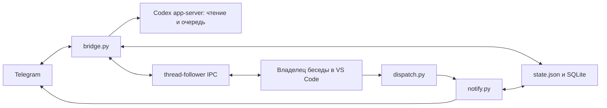

# Руководство разработчика Кодекс Пульта

Актуально на 10.10.2026. Установка нового пользователя: [SETUP.md](SETUP.md). Экранные сценарии: [USER_GUIDE.md](USER_GUIDE.md). Правила агента: [AGENTS.md](AGENTS.md). Здесь описано текущее устройство, без истории отменённых решений.

## С чего начать разработчику

1. Выполните SETUP.md со своим ботом и аккаунтом на отдельном Mac/профиле пользователя.
2. Прочитайте AGENTS.md, проверьте `git status --short`, версии CLI/расширения и текущую конфигурацию сервиса без вывода секретов.
3. Для исправлений протокола исследуйте установленную версию расширения и схему CLI; публичный app-server не описывает приватный IPC VS Code.
4. Сделайте изменение и изолированные тесты; обновите соответствующие руководства.
5. Запустите тесты и проверьте diff. Только после этого примените код через restart. Проверяйте модельные сценарии в отдельной безопасной беседе.
6. Коммит/пуш делайте по запросу пользователя. Не включайте локальные настройки и данные.

## Архитектура



Telegram updates получаются long polling без webhook и внешнего порта. При создании Bridge app-server получает experimentalApi=true. Нативная очередь использует thread/queue/add, list, delete. Мост не делает resume существующей беседы и не запускает очередь через queue/start или turn/start: модель выполняет исходный владелец VS Code.

Новый чат — исключение: короткий процесс new_chat.py создаёт новую legacy-беседу, inject_items сохраняет запись о происхождении, unsubscribe и завершение передают её VS Code. Модель при создании не запускается. Успешный open URI не доказывает наличие живого владельца.

## Карта кода

| Модуль | Назначение |
|---|---|
| bridge.py | Жизненный цикл, команды Telegram, app-server RPC, callback-контекст ветки |
| features.py | Outbox, snapshots, разрешения, выбор/получение файлов; совместимость прежних задач |
| native_queue.py | Атомарные add/list/delete, отслеживание client/turn, остановка через владельца |
| chat_menu.py | 20 уникальных бесед, по 5, фиксированный список и компактные заголовки |
| topics.py | Постоянная взаимно однозначная привязка Telegram topic ↔ Codex thread |
| vscode_ipc.py | Unix socket, framing, discovery, подписки, версии методов и UI input |
| questions.py | Blocking и async вопросы, варианты/свой ответ, исходный owner |
| mirror.py | Копии новых десктопных запросов, защита от эха Telegram |
| notify.py | Telegram API, TLS, финалы, setup/test и оформление |
| dispatch.py | Вызов прежнего notify и текущего Telegram notify |
| chat_store.py | SQLite: названия, message routing, темы, файлы, зеркалирование и receipts |
| progress.py | Удаление временных статусов и подтверждение полной доставки финала |
| delivery.py | O_EXCL claim против одновременных дублей финала |
| layout.py | Markdown-подмножество и Telegram UTF-16 entities |
| media.py | Загрузка одного изображения/документа до 20 МБ |
| outgoing.py | Проверка локальных Markdown-ссылок и multipart sendDocument до 50 МБ |
| new_chat.py | Создание, сохранение и открытие беседы |
| ui.py | Постоянная клавиатура, алиасы старых кнопок, краткая справка и лимиты |
| mode.py | Сохранённый переключатель режима, по умолчанию выключен |
| runtime.py | flock одного экземпляра |
| autostart.py | Установка/управление LaunchAgent текущего пользователя |

Все эти модули используются. Алиасы старых кнопок, прежних callback и восстановление legacy active/outbox сохранены ради существующих сообщений и задач; это не новые альтернативные режимы. Не удаляйте их без миграции и регрессионных проверок. Старые описания поведения удалены из документации.

## Хранилища и маршрутизация

`credentials.json` — token/chat_id, права 0600; создаётся notify.py --setup. `mode.json` — /on-/off. `state.json` — Telegram offset, выбор беседы, непереданный outbox, native receipts, карты кнопок и последние 20 меню; запись через temp + rename. Offset сохраняется до исполнения update, поэтому при сбое обработка принятого сообщения может быть потеряна, но не повторяется автоматически.

`messages.sqlite3` — общая база моста и hook: messages, threads, downloads, question_replies, mirror_* и progress_*. topics.py добавляет telegram_topics с UNIQUE(chat,thread) и PRIMARY KEY(chat,topic). Привязка неизменна. Unknown topic не подставляет глобальный выбор. Reply из другой беседы отклоняется. В основном чате работает выбор/reply; создание нового чата из уже связанной ветки создаёт другую ветку.

`topics.lock` синхронизирует создание тем между hook и мостом; getMe cached 60 секунд. BotFather: has_topics_enabled=true, allows_users_to_create_topics=false. Удаление Telegram-ветки пока не имеет автоматического восстановления.

Меню чатов заморожено по ID, dedup страниц API с пределом обхода. Новый список не сдвигает старый. Каждая пятёрка — отдельное сообщение; предыдущие кнопки сохраняются. Компактный режим отправляет entities=[] без обычного заголовка. Старые заголовки сокращаются editMessageText без reply_markup, чтобы сохранить кнопки. Ошибки редактирования повторяются sweep с интервалом 30 секунд; меню не удаляются.

Все runtime-файлы, deliveries, incoming, logs, previous-notify.json, `.venv` и `.env*` исключены из Git. Их не очищают ради теста. previous-notify.json содержит только локальную команду прежнего notify; dispatch.py в нём недопустим (рекурсия).

## Общая очередь и финалы

queue.thread фиксируется при приёме. До отправки phone client ID сохраняется в mirror_phone, чтобы телефонное сообщение не зеркалилось. Add подтверждён → убрать outbox и сохранить native_queue_receipts; неопределённая передача → uncertain, не повторять. Блокируется только соответствующая беседа, внутри неё FIFO; прочие могут продолжать.

Порядок определяет фактический приём Codex, а не время Telegram. Пауза и /off касаются только непереданного phone outbox. Удаление queued submission не останавливает уже начавшийся turn. /stop использует свежий snapshot, исходного owner и expectedTurnId; принятая очередь не очищается.

Snapshots связывают client ID с turn, включая canonical turnHistory. Подписки: выбранная беседа, legacy active, весь outbox/receipts и 10 недавних корневых бесед. History interrupted может быть временным хвостом: нужен подтверждённый статус владельца. Посторонний app-server turn/completed не очищает native active/approvals.

Hook и polling используют общий delivery claim и progress_finals. Claim означает только занятую попытку; удалять receipt можно после подтверждения полной отправки. Перед финалом удаляются временные статусы; сбой очистки не повторяет финал и не блокирует ответ, sweep повторяет удаление. Telegram ограничивает удаление возрастом сообщения. Ошибки, формы, ручной /queue, подключение и меню выбора не удаляются этим механизмом.

Гарантии доставки ограничены: crash после claim может оставить пропуск; частичный retry после сетевого сбоя может продублировать части. Не обещайте exactly-once во всех авариях. Живые тесты подтверждают отсутствие дублей в проверенном сценарии, а не универсальную гарантию.

## Разрешения, вопросы и файлы

Разрешения передаются исходному owner/thread/requestId по свежему snapshot; только scope=turn. Старый или исчезнувший запрос не разрешается. При выключенном режиме approvals не принимаются. Разрешения не расширяются автоматически.

Blocking item/tool/requestUserInput отвечает через thread-follower-submit-user-input v1. Async agentMessage.questions возвращает структурированный send_user_message_question_reply через thread-follower-steer-turn v1 при active или start-turn v2 после завершения. Несколько ответов отправляются вместе; частичные ответы после restart надо выбрать снова. Закрывать вопрос можно только после принятого ответа. Конфиденциальные вопросы — только VS Code.

UI input всегда содержит text_elements: []. Вложения проходят проверки размера/типов; альбомы не поддерживаются. Документ сохранён локально, путь передан агенту для чтения. Downloads привязаны к пути/проекту/беседе. Файлы доступны только внутри разрешённого cwd после resolve; служебные каталоги и секреты исключаются. Автоматические отдельные file offers отключены; пользователь вызывает /files.

## Проверка и применение

Из папки репозитория с активированным Python:

```sh
PYTHONDONTWRITEBYTECODE=1 python3 -m unittest discover -s tests -v
git diff --check
python3 autostart.py restart
python3 autostart.py status
```

93 изолированных теста проходят на 10.10.2026. Для документации без изменения runtime restart не нужен: /guide читает файл с диска. Для изменения ui.py/другого кода нужен restart; Reload Window нужен после изменения глобального notify, не после обычного Python-обновления.

Живые проверки: text/image/document/reply, скачивание, разовые accept/decline, готовый/свой ответ, смешанная очередь desktop/Telegram, сохранение двух pending после restart и доставка финалов, async вопрос с ответом «АЛЬФА», меню. Отдельная длительная goal-задача не запускалась; проверен механизм async-вопроса. План: [DEVELOPMENT_PLAN.md](DEVELOPMENT_PLAN.md).

Для нового компьютера обязательна контрольная беседа SETUP.md. Не запускайте тестовую задачу в работающем пользовательском чате и не очищайте реальные очереди.

## Совместимость и диагностика

Проверено: Python 3.13, CLI 0.153.0, openai.chatgpt-26.930.41038-darwin-arm64. Документированная установка использует Python ≥3.11 для tomllib. На другой версии расширения приватный протокол может измениться. Проверьте локальные assets без их редактирования и schema CLI в временной папке.

В vscode_ipc.py зафиксированы initialize=0, owner-discovery=1, start-turn=2, interrupt-turn=4, command/file/permissions approvals=1, submit-user-input=1, steer-turn=1. Сокет CODEX_HOME/ipc/ipc.sock проверяется по владельцу и правам. Мост не меняет аккаунт, модель, sandbox, installed extension или JSONL историю.

LaunchAgent: `~/Library/LaunchAgents/local.codex-remote-pult.plist`, текущий gui/<uid>, label local.codex-remote-pult. Install фиксирует sys.executable и абсолютный путь bridge.py. PATH включает каталог этого Python, ~/.npm-global/bin, /opt/homebrew/bin, /usr/local/bin и системные каталоги. Если Node/Codex стоят в иной папке, добавьте их каталоги к EnvironmentVariables.PATH этого plist, остановив сервис и сохранив plist как резервную копию; затем start. Не полагайтесь на shell aliases или активацию fnm/nvm в интерактивном Terminal. Повторный install генерирует PATH заново. Нестандартный CODEX_HOME тоже задайте в plist и одинаково в VS Code.

После переноса папки или Python обновите notify и переустановите LaunchAgent. Если существующий plist принадлежит другому пути, autostart.py откажет: uninstall выполните из старой папки, затем install из новой. Не заменяйте чужой сервис молча.

| Симптом | Проверять |
|---|---|
| Не running / Codex не найден | logs/bridge.err.log, PATH, Python, node/codex |
| 409 polling | Второй bridge или webhook того же бота |
| Нет owner / ожидание | Открыта ли именно нужная локальная беседа VS Code |
| version mismatch | CLI/extension версии и приватный протокол |
| TLS | certifi в фактическом Python, сеть/VPN; не отключать проверку |
| uncertain | Native queue + история до повторной отправки |
| Сбой темы | BotFather, удаление темы, thread binding; fallback пока не реализован |

Ошибки notify санитизируются: не печатайте URL с токеном, whole snapshots или credentials. Для баг-репорта достаточно версии, команды и обезличенного сообщения об отказе.
